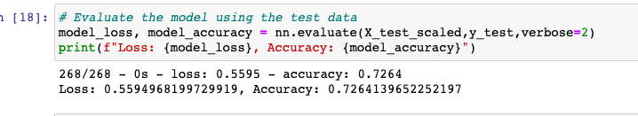
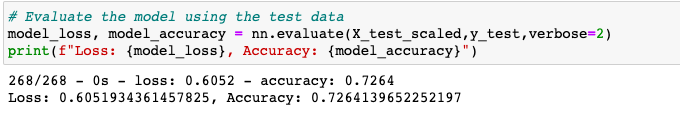

# Neural_Network_Charity_Analysis
## Neural Networks

## <b>Overview of the Analysis</b>
The purpose of the analysis is to utilize deep learning (neural networks) to predict which Alphabet Soup funded projects will use their funding successfully.  This will be established using data from previous projects and training the neural network to predict the success outcome.

## <b>Results</b>

Using bulleted lists and images to support your answers, address the following questions.

## *Data Preprocessing*
### What variable(s) are considered the target(s) for your model?
The target variable for is the "Is Successful" variable which states whether the applicants were successful after funding by Alphabet soup.
    

### What variable(s) are considered to be the features for your model?
The variables that are the features of the model are:

- APPLICATION_TYPE	
- AFFILIATION	
- CLASSIFICATION	
- USE_CASE	
- ORGANIZATION	
- STATUS	
- INCOME_AMT	
- SPECIAL_CONSIDERATIONS
- ASK_AMT

### What variable(s) are neither targets nor features, and should be removed from the input data?

The variable that should be removed are the identification variables: EIN and NAME. They are being excluded as they do not provide any additional data to the data set.

## *Compiling, Training, and Evaluating the Model*

- ### How many neurons, layers, and activation functions did you select for your neural network model, and why?
In my original model I used 2 hidden layers each with 86 nodes in each layer. However, the second layer did not significantly raise the accuracy score. I used the relu activation for each hidden layer and sigmoid for the outer layer. Sigmoid or Softmax are the best activations to use when
retrieving binary output, like whether a charity was successful or not.

### Were you able to achieve the target model performance?

Unfortunately, I was unable to increase the model's accuracy higher than 73%.

Alphabet Soup Charity Accuracy:
</img>

Alphabet Soup Charity Optimized Model:
</img>

### What steps did you take to try and increase model performance?

The steps taken to try to increase the models performance are:
-  To bin the ASK_AMT feature down to two options, 5000 or Other. 5000 was the minimum, median and mode for the ASK_AMT feature, with over 25000 incidences of a $5000 request. Any request for more than $5000 was binned together as they were are rare occurrences.

- In my optimized model, I selected 3 hidden layers. The first layer contains 123 nodes(3x the amount of features), the second and third layers contain 246 nodes in an attempt to increase the model's performance. The activation functions for the hidden layers are ReLu. The outer layer uses a Sigmoid activation. Switching to a Softmax or Tanh activation dropped the accuracy by up to 20%.

- I also changed the number of epochs to 150 to give the model more time to train and tried removing the "income_amt" variable, as it contained a lot of variation (and possibly inaccuracies) and a lot of NaNs before cleaning; however, that further dropped the accuracy down to 72%

## <b>Summary</b>

Overall, while our model has decent accuracy (73%) it doesn't achieve the required 75% accuracy and only predicts whether funding applications are successful or not 73% of the time. This may not be high enough for Alphabet Soup. 

Having tried a lot of combinations of optimizations with this challenge, a next step would be trying a different model - such as the Keras Functional model or PyTorch. 

A different kind of ML such as PCA with Random Forest may be better at classifying categorical data.